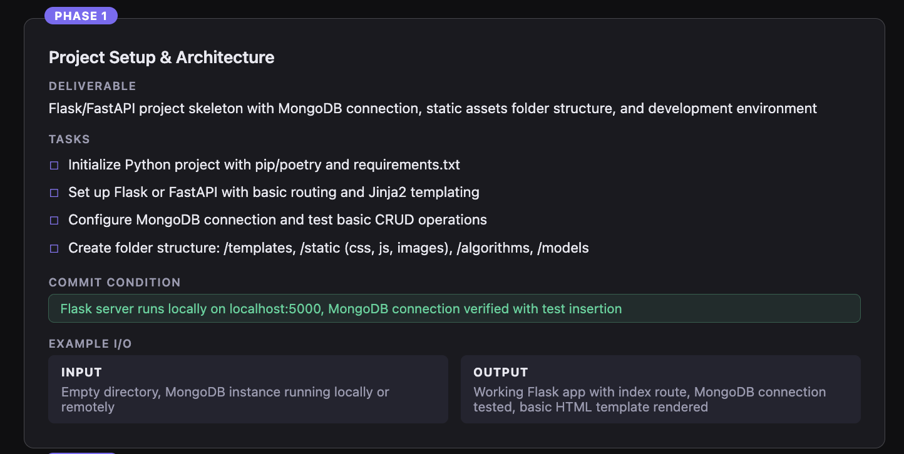

# PhaseCompiler — Web UI

A [self-hosted web app](https://cypherguy--phase-compiler-web.modal.run) that turns your project spec into a structured, phased execution plan using a two-agent Claude system. You fill in a form, two AI agents debate the output, and you get a dependency-ordered roadmap with deliverables, tasks, commit conditions, and examples for each phase.

## The Process

There are two agents that interact with each other after submitting details via a single form submission:

1. Fill in the form: Add things like your project name, description, definition of done, MVP features, language, runtime, starting point, and number of phases (6–12). There's also optional fields for you to add architecture style, scaling strategy, constraints and things to avoid.
2. The Planner agent takes your spec and makes a complete JSON plan following the PhaseCompiler schema: title, deliverable, tasks, commit condition, and example I/O for each phase.
3. The Analyzer agent checks for certain things in order to make it higher quality: Things like if commit conditions are testable, phases are properly sequenced, and deliverables are concrete. If it approves, the result is returned immediately. If it rejects, its feedback is passed back to the Planner for a revised attempt — up to 3 debate rounds.

By splitting the process into two agents, each one can focus on its own job. This produces tighter plans than a single agent doing both at once.

A live status feed shows which agent is running and logs each debate round in real time.

## Why This Tool

Sometimes when I sit down to program, I have no idea where to begin. I may not have a clear idea of what I want to build, or I may have no clue how to structure it. Just telling an AI to "build me a plan" doesn't clarify scope, dependencies, or deliverables, which is where this tool comes in. PhaseCompiler:

- Forces you to define what "done" means, what constraints matter, and what your MVP looks like
- Ensures each phase is scoped relative to your tech choices and previous phases
- Has a second agent review the plan so vague or unordered phases get caught before you start building
- Costs roughly $0.02 per 8-phase plan from testing
- Shows a pre-flight token estimate before you spend anything

Unlike the Claude skill in the main branch (which integrates into Claude Desktop) or the CLI in the `cli` branch (which runs from the terminal), This branch is a hosted form you can open in any browser. It only needs a Modal account and your Anthropic API key. Alternatively you can just

## Installation

### Prerequisites

- **Python 3.11+**
- **Modal account** — [sign up here](https://modal.com/) (free tier is enough)
- **Anthropic API key** — [get one here](https://console.anthropic.com/)

### Steps

1. **Clone the repo and switch to this branch:**

   ```bash
   git clone https://github.com/CypherGuy/phase-compiler.git
   cd phase-compiler
   git checkout website
   ```

2. **Create a virtual environment and install Modal:**

   ```bash
   python -m venv .venv
   source .venv/bin/activate   # Windows: .venv\Scripts\activate
   pip install modal
   ```

3. **Authenticate with Modal:**

   ```bash
   modal token new
   ```

4. **Deploy:**

   ```bash
   modal deploy modal_app.py
   ```

   The output will show your endpoint URL:

   ```
   https://your-username--phase-compiler-web.modal.run
   ```

5. **Open the URL in your browser and paste in your Anthropic API key.** It is used only for that request and never stored.

---

## Usage

### Filling in the form

The form is split into required fields and optional settings.

**Required:**

- **Project Name** — Short name, max 50 characters
- **Description** — What does it do? Max 1000 characters
- **Definition of Done** — One condition per line. What does "finished" look like?
- **MVP Features** — Core features only, one per line. No scaling or secondary features yet
- **Language** — e.g. `python`, `typescript`, `rust`
- **Main User** — Who uses it? Default: `Just Myself`
- **Runtime** — CLI / Web / Mobile / Desktop / Library
- **Starting Point** — Nothing from scratch / Existing codebase / Prototype / MVP already done
- **Number of Phases** — Integer from 6–12

**Optional** (expand the section):

- **Architecture** — Microservices / Event-driven / Serverless / Other
- **Scaling Strategy** — None / Vertical / Horizontal / Serverless / Auto
- **Expected Scale** — e.g. `single user`, `10k DAU`
- **Architecture Notes** — Frameworks, patterns, extra design context
- **Constraints** — Budget, time, team size, technical limits — one per line
- **Avoid** — Tools, patterns, or practices to skip — one per line

### Estimating cost first

Click the button labbeled 'Estimate tokens first'. to show you the estimated input token count and cost breakdown before anything is generated.

### Generating the plan

Click **Generate Roadmap**. The loading overlay shows live status:

- Which agent is running
- Whether the Analyzer approved or rejected
- How many debate rounds occurred

On approval, the results page appears.

---

## Output

The results page shows:

- Project data — Language, runtime, phase count, and how many agent rounds it took (e.g. `1 (approved first try ✨)`)
- Token usage card — Input tokens, output tokens, cache written, total cost, and how far off the pre-flight estimate was
- Phase cards — One per phase, each with:
  - Title and deliverable
  - Task checklist (3–5 items)
  - Commit condition badge
  - Example input / output boxes
- Raw JSON toggle — Expand to copy the full `plan.json`



Or in JSON form:

```json
{
  "id": 3,
  "title": "Database Schema & Algorithm Storage",
  "deliverable": "MongoDB collections for algorithms with metadata, code, and descriptions; seed data loaded for all algorithms",
  "tasks": [
    "Define MongoDB schema: Algorithm collection with fields (name, code, pseudocode, description, difficulty, time_complexity, space_complexity)",
    "Create migration/seed script to insert all 8+ algorithms with metadata into MongoDB",
    "Add indexes on algorithm name and difficulty for fast retrieval",
    "Write functions to fetch algorithm by name, list all algorithms, and retrieve algorithm code"
  ],
  "commit_condition": "MongoDB contains 8+ algorithm documents, queries return correct algorithm metadata and code in <100ms",
  "example_input": "Empty MongoDB instance",
  "example_output": "MongoDB collection 'algorithms' with 8 documents; query db.algorithms.find({name: 'Bubble Sort'}) returns full record with code"
}
```

---

## Best Practices

### 1. Be specific in your description

Vague descriptions produce vague phases. "A FastAPI backend with JWT auth and PostgreSQL" gives the Planner enough to sequence things correctly. "A backend app" does not.

### 2. Write testable done conditions

- ✅ "Users can click any algorithm and see a step-by-step visualisation"
- ✅ "All 8 algorithm pages load without errors"
- ❌ "The site works" (too vague — the Analyzer will reject this)

### 3. Keep the MVP list short

The Planner scopes every phase around your MVP features. More MVP items means more phases touch them, which means longer output and more tokens. List only the core value — no nice-to-haves.

### 4. Choose a realistic phase count

- **6 phases**: Small projects or simple features
- **8–10 phases**: Medium projects with several distinct concerns
- **12 phases**: Large projects with complex architecture and many tracks

### 5. Leave optional fields blank if unused

Architecture notes, constraints, and avoid lists all add to the input prompt and cost. Skip them unless they affect how the phases should be structured.

### 6. Clear done conditions prevent debate rounds

If the Analyzer rejects the plan, both agents run again. Clear, specific done conditions and a concrete description almost always get approved in round 1. Debate rounds roughly double the cost.

---

## Cost

The web version uses **Claude Haiku 4.5** — the cheapest available Claude model. Prompt caching is enabled on both agent system prompts, which saves ~90% on system prompt tokens in debate rounds 2 and 3.

Typical costs from testing:

| Plan size | Rounds | Approx. cost |
| --------- | ------ | ------------ |
| 6 phases  | 1      | ~$0.015      |
| 8 phases  | 1      | ~$0.020      |
| 10 phases | 1      | ~$0.028      |
| Any size  | 2–3    | ~2–3× above  |

The token usage card on the results page shows the exact breakdown every time.

---

## File Structure

```
phase-compiler/
├── modal_app.py        # Modal deployment — FastAPI app, form HTML, both agents
├── SKILL.md            # PhaseCompiler skill instructions (copied into the Modal image)
├── schema.py           # Pydantic models for spec & plan validation
└── README.md           # This file
```

The entire app lives in `modal_app.py`. The HTML form, both agent prompts, the debate loop, and the SSE streaming endpoint are all in that one file.

---

## License

MIT
